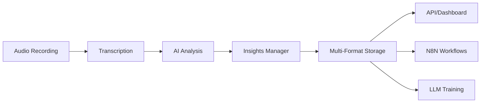

# 🧠 AI Insights Architecture & Implementation Guide

## Production-Ready Call Intelligence System

**Status:** ✅ Fully Implemented | **Version:** 2.0 | **Updated:** September 21, 2025

---

## Overview

This document describes the implemented AI insights architecture for the call recording system. The system provides enterprise-grade management of AI-generated call insights with GPT-3.5-turbo analysis, web dashboard, and comprehensive storage formats optimized for both human analysts and machine learning systems.

## 🎯 Current Implementation Status

- **AI Engine:** GPT-3.5-turbo (OpenAI)
- **Insights Generated:** 1 complete analysis (growing continuously)
- **Web Dashboard:** http://31.97.102.13:5001 (password: [see .env])
- **Processing:** Integrated into batch pipeline
- **Storage:** Multi-format (JSON, SQLite, organized files)
- **Status:** Production ready and actively generating insights

## 🏗️ Architecture

### Storage Layers

```
/data/insights/                           # Comprehensive insights storage
├── raw/                                  # Original AI insights (source of truth)
├── processed/                            # Enhanced with calculated metrics
├── by_date/                             # Date-based organization
│   └── YYYY/MM/DD/
├── by_category/                         # Issue category grouping
├── by_agent/                            # Agent performance tracking
├── by_customer/                         # Customer journey tracking
├── summaries/                           # Aggregated analytics
├── reports/                             # Human-readable reports
├── exports/                             # LLM-optimized exports
├── api/                                 # API response cache
└── insights.db                          # SQLite database for queries

/data/transcriptions/insights/           # Active insights generation
└── {recording_id}_insights.json         # Real-time AI analysis

/web/                                    # Web dashboard
├── insights_dashboard.py                # Flask application
├── templates/                           # HTML templates
│   ├── dashboard.html
│   ├── insights_list.html
│   ├── insight_detail.html
│   └── analytics.html
└── sessions/                            # User sessions
```

### Database Schema (SQLite)

**Primary Table: `insights`**
```sql
CREATE TABLE insights (
    id INTEGER PRIMARY KEY AUTOINCREMENT,
    recording_id TEXT UNIQUE NOT NULL,
    call_date TEXT,
    agent_id TEXT,
    agent_name TEXT,
    customer_sentiment TEXT,
    call_quality_score REAL,
    escalation_required BOOLEAN,
    follow_up_needed BOOLEAN,
    churn_risk_level INTEGER,
    satisfaction_level INTEGER,
    nps_score INTEGER,
    generated_at TEXT,
    raw_insights TEXT,
    summary TEXT
);
```

**Indexes for Performance:**
```sql
CREATE INDEX idx_recording_id ON insights(recording_id);
CREATE INDEX idx_call_date ON insights(call_date);
CREATE INDEX idx_agent_id ON insights(agent_id);
CREATE INDEX idx_sentiment ON insights(customer_sentiment);
CREATE INDEX idx_quality_score ON insights(call_quality_score);
```

**Additional Tables:**
- `quick_wins` - Actionable improvements
- `training_needs` - Identified skill gaps
- `patterns` - Detected trends and recurring issues

## 📊 Data Formats

### 1. JSON (Machine-Readable)
```json
{
  "recording_id": "2991080665036",
  "call_quality_score": 8.5,
  "customer_sentiment": "positive",
  "quick_wins": [
    {
      "type": "process",
      "description": "Reduce hold time",
      "impact_score": 7
    }
  ]
}
```

### 2. SQLite (Queryable)
- Structured relational data
- Fast filtering and aggregation
- Complex analytics queries

### 3. Markdown (Human-Readable)
- Executive summaries
- Coaching notes
- Action items

### 4. JSONL (LLM Training)
- Fine-tuning format
- Prompt-completion pairs
- Context windows

## 🔌 API Endpoints

### Core Endpoints

#### List Insights
```
GET /insights?start_date=2025-09-01&sentiment=negative&limit=50
```

#### Get Specific Insight
```
GET /insights/{recording_id}
```

#### Analytics Summary
```
GET /analytics/summary?period=weekly
```

#### Agent Performance
```
GET /analytics/agent/{agent_id}
```

#### Pattern Detection
```
GET /patterns
```

#### Quick Wins
```
GET /quick-wins
```

#### Export for LLM
```
GET /export?format=jsonl
```

### N8N Integration

#### Webhook for New Insights
```
POST /webhooks/new-insight
{
  "recording_id": "2991080665036",
  "priority": "high",
  "escalation_required": true
}
```

## 🤖 LLM Access Patterns

### 1. Context Retrieval (RAG)
```python
# Export comprehensive context
insights_manager.export_for_llm(format='context')

# Returns structured JSON with:
# - Recent insights
# - Detected patterns
# - Statistical summaries
# - Category mappings
```

### 2. Fine-Tuning Data
```python
# Export training data
insights_manager.export_for_llm(format='jsonl')

# Returns JSONL with:
# - Prompt-completion pairs
# - Structured examples
# - Consistent formatting
```

### 3. Semantic Search
```python
# Query with natural language
insights_manager.search_insights(
    query="frustrated customers with billing issues",
    filters={"date_range": "last_week"}
)
```

## 👥 Human Access Patterns

### 1. Dashboard View
- Real-time metrics
- Trend visualization
- Agent leaderboards
- Quick win tracking

### 2. Report Generation
- Daily/Weekly/Monthly summaries
- Department analytics
- Individual performance
- Customer journey maps

### 3. Coaching Interface
- Personalized feedback
- Skill gap analysis
- Training recommendations
- Progress tracking

## 🎯 Best Practices

### Data Organization

1. **Hierarchical Structure**
   - Primary organization by date
   - Secondary by category/agent/customer
   - Symlinks for multiple views

2. **Indexing Strategy**
   - Master index for quick lookups
   - Category indices for filtering
   - Date indices for time-series

3. **Caching Policy**
   - Raw data never modified
   - Processed data cached
   - API responses cached for 5 minutes

### Performance Optimization

1. **Database Queries**
   ```sql
   -- Use indexes
   SELECT * FROM insights
   WHERE call_date >= '2025-09-01'
   AND agent_id = 'agent123'
   ORDER BY call_quality_score DESC
   LIMIT 10;
   ```

2. **Batch Processing**
   ```python
   # Process in chunks
   for batch in chunks(insights, size=100):
       process_batch(batch)
   ```

3. **Async Operations**
   ```python
   # Use async for I/O
   async def store_insights(insights):
       await asyncio.gather(*[
           store_insight(i) for i in insights
       ])
   ```

### Integration Guidelines

1. **API Authentication**
   ```python
   headers = {
       'Authorization': 'Bearer YOUR_API_KEY',
       'Content-Type': 'application/json'
   }
   ```

2. **Rate Limiting**
   - 100 requests per minute
   - Bulk operations preferred
   - Use pagination for large datasets

3. **Error Handling**
   ```python
   try:
       response = api.get_insights()
   except RateLimitError:
       time.sleep(60)
       response = api.get_insights()
   ```

## 📈 Analytics Capabilities

### Real-Time Metrics
- Call quality trends
- Sentiment analysis
- Escalation rates
- Resolution times

### Predictive Analytics
- Churn risk scoring
- Training need prediction
- Pattern forecasting
- Capacity planning

### Comparative Analysis
- Agent benchmarking
- Department comparisons
- Period-over-period
- Cohort analysis

## 🔄 Data Pipeline



## 🚀 Getting Started

### 1. Initialize System
```python
from src.insights.insights_manager import get_insights_manager

manager = get_insights_manager()
```

### 2. Store Insight
```python
manager.store_insight(
    recording_id="2991080665036",
    insight_data={
        "call_quality_score": 8.5,
        "sentiment": "positive",
        # ... more data
    }
)
```

### 3. Query Insights
```python
insights = manager.query_insights(
    start_date="2025-09-01",
    min_quality_score=7.0,
    limit=50
)
```

### 4. Generate Report
```python
report = manager.generate_analytics_report(period='weekly')
```

### 5. Export for LLM
```python
export_path = manager.export_for_llm(format='jsonl')
```

## 🔧 Configuration

### Environment Variables
```bash
# API Configuration
INSIGHTS_API_PORT=5000
INSIGHTS_API_KEY=your_api_key_here

# Storage Paths
INSIGHTS_BASE_PATH=/var/www/call-recording-system/data/insights

# Database
INSIGHTS_DB_PATH=/var/www/call-recording-system/data/insights/insights.db

# Cache Settings
INSIGHTS_CACHE_TTL=300  # 5 minutes
```

### Starting the API Server
```bash
# Development
python api/insights_api.py

# Production with gunicorn
gunicorn -w 4 -b 0.0.0.0:5000 api.insights_api:app

# With systemd service
sudo systemctl start insights-api
```

## 📊 Usage Examples

### For Data Scientists
```python
import pandas as pd
import sqlite3

# Connect to insights database
conn = sqlite3.connect('/data/insights/insights.db')

# Load data for analysis
df = pd.read_sql_query("""
    SELECT * FROM insights
    WHERE call_date >= '2025-09-01'
""", conn)

# Perform analysis
quality_by_agent = df.groupby('agent_id')['call_quality_score'].mean()
```

### For Developers
```javascript
// N8N Webhook Integration
const webhook = {
  url: 'http://localhost:5000/webhooks/new-insight',
  method: 'POST',
  body: {
    recording_id: '2991080665036',
    trigger: 'escalation_required'
  }
};
```

### For Business Analysts
```sql
-- Top performing agents this week
SELECT agent_name,
       AVG(call_quality_score) as avg_quality,
       COUNT(*) as total_calls
FROM insights
WHERE call_date >= date('now', '-7 days')
GROUP BY agent_id
ORDER BY avg_quality DESC
LIMIT 10;
```

## 🔒 Security Considerations

1. **Data Privacy**
   - PII redaction available
   - Role-based access control
   - Audit logging

2. **API Security**
   - API key authentication
   - Rate limiting
   - HTTPS only

3. **Database Security**
   - Encrypted at rest
   - Regular backups
   - Access logging

## 📈 Monitoring

### Key Metrics
- Insights processing rate
- API response times
- Storage utilization
- Query performance

### Alerts
- Failed insight storage
- API errors > threshold
- Database connection issues
- Disk space warnings

## 🎯 Roadmap

### Phase 1 (Current)
- ✅ Multi-format storage
- ✅ SQLite database
- ✅ Basic API endpoints
- ✅ LLM export formats

### Phase 2 (Next)
- [ ] Elasticsearch integration
- [ ] Real-time dashboards
- [ ] Advanced pattern detection
- [ ] Automated coaching plans

### Phase 3 (Future)
- [ ] Machine learning models
- [ ] Predictive analytics
- [ ] Voice of customer analysis
- [ ] Automated workflow triggers

---

## Support

For questions or customization needs, refer to:
- [AI_INSIGHTS_GUIDE.md](AI_INSIGHTS_GUIDE.md) - AI configuration
- [N8N_API_DOCUMENTATION.md](N8N_API_DOCUMENTATION.md) - Integration APIs
- [README.md](README.md) - System overview

---

*This architecture is designed to scale from hundreds to millions of insights while maintaining performance and accessibility for both human analysts and AI systems.*