# 🔒 SECURITY: Audio File Deletion Policy

## ⚠️ CRITICAL SECURITY REQUIREMENT

**ALL AUDIO RECORDINGS ARE AUTOMATICALLY DELETED AFTER TRANSCRIPTION**

This system implements a strict security policy where:
1. Call recordings are NEVER permanently stored
2. Audio files are DELETED immediately after successful transcription
3. ONLY transcripts are saved to Google Drive
4. Deletion is verified and logged for audit compliance

## Why This Policy?

- **Privacy Protection**: Call recordings may contain sensitive personal information
- **Compliance**: Many regulations require minimal retention of voice recordings
- **Storage Optimization**: Audio files are large; transcripts are compact
- **Security**: Reduces attack surface by not storing raw audio data

## Implementation Details

### 1. Secure Storage Handler

The `SecureStorageHandler` class ensures:
- ✅ Transcripts are saved to Google Drive
- ✅ Audio files are securely deleted
- ✅ Deletion is verified
- ✅ Audit logs are maintained

```python
# Example flow
storage_handler.process_transcription(
    audio_file_path="/tmp/recording.wav",  # Will be DELETED
    transcription_result=transcript,        # Will be SAVED
    call_metadata=metadata                  # Will be SAVED
)
# Result: Transcript saved, audio deleted
```

### 2. Deletion Methods

The system uses multiple deletion methods for security:

1. **Secure Overwrite** (when available):
   - Uses `shred` command on Linux
   - Overwrites file data before deletion
   - Prevents data recovery

2. **Standard Deletion**:
   - Uses `os.remove()` as fallback
   - File is unlinked from filesystem

3. **Verification**:
   - Confirms file no longer exists
   - Logs verification status

### 3. Audit Trail

Every deletion is logged with:
- Timestamp of deletion
- File hash (SHA-256) before deletion
- File size deleted
- Deletion method used
- Verification status

Audit logs location: `/var/www/call-recording-system/logs/deletion_audit.log`

### 4. Database Tracking

The database tracks deletion status:
- `audio_deleted`: Boolean flag
- `audio_deletion_time`: Timestamp
- `audio_deletion_verified`: Verification status
- `audio_file_hash`: SHA-256 hash for audit

### 5. Google Drive Security

**IMPORTANT**: The system NEVER uploads audio to Google Drive
- Only JSON transcripts are uploaded
- Audio files are explicitly excluded
- Verification function ensures no audio in Drive

## Verification Commands

### Check Deletion Status
```sql
-- Check how many recordings have been deleted
SELECT
    COUNT(*) as total,
    SUM(CASE WHEN audio_deleted = true THEN 1 ELSE 0 END) as deleted,
    SUM(CASE WHEN audio_deletion_verified = true THEN 1 ELSE 0 END) as verified
FROM call_recordings;
```

### Verify No Audio in Google Drive
```python
# Run verification
from src.storage.secure_storage_handler import SecureStorageHandler
handler = SecureStorageHandler(drive_manager)
result = handler.verify_no_audio_in_drive()
print(f"No audio files in Drive: {result['verified']}")
```

### Check Audit Logs
```bash
# View recent deletions
tail -f /var/www/call-recording-system/logs/deletion_audit.log | jq '.'

# Count deletions today
grep "$(date +%Y-%m-%d)" /var/www/call-recording-system/logs/deletion_audit.log | wc -l
```

## Configuration

### Environment Variables
```bash
# Enable/disable deletion (should always be true in production)
AUDIO_DELETE_AFTER_TRANSCRIPTION=true

# Enable audit logging
ENABLE_DELETION_AUDIT=true

# Verify deletion
VERIFY_AUDIO_DELETION=true

# Local transcript backup (optional)
TRANSCRIPT_BACKUP_DIR=/var/www/call-recording-system/data/transcript_backups
```

## Processing Flow

```mermaid
graph TD
    A[Download Recording] --> B[Transcribe Audio]
    B --> C{Transcription Successful?}
    C -->|Yes| D[Save Transcript to Google Drive]
    C -->|No| E[Retry Transcription]
    D --> F[Calculate Audio Hash for Audit]
    F --> G[DELETE Audio File]
    G --> H[Verify Deletion]
    H --> I[Log to Audit Trail]
    I --> J[Update Database]
    J --> K[✅ Complete - Audio Deleted]
    E -->|Max Retries| L[❌ Mark Failed]
```



## Monitoring

### Key Metrics
- **Audio Files Deleted**: Total count
- **Deletion Success Rate**: Percentage verified
- **Storage Saved**: Total MB deleted
- **Audit Compliance**: Logs maintained

### Alerts
System alerts when:
- Audio deletion fails
- Verification fails
- Audio files found in Google Drive
- Audit log write fails

## Recovery Procedures

### If Deletion Fails

1. **Check logs**:
   ```bash
   grep "ERROR.*deletion" /var/www/call-recording-system/logs/app.log
   ```

2. **Manual deletion**:
   ```bash
   # Find undeleted audio files
   find /var/www/call-recording-system/data/audio -type f -name "*.wav" -o -name "*.mp3"

   # Securely delete
   shred -vfz -n 3 /path/to/audio/file
   ```

3. **Update database**:
   ```sql
   UPDATE call_recordings
   SET audio_deleted = true,
       audio_deletion_time = NOW(),
       audio_deletion_verified = true
   WHERE recording_id = 'xxx';
   ```

## Compliance Notes

This implementation helps meet requirements for:
- **GDPR**: Right to erasure, data minimization
- **HIPAA**: Minimum necessary standard
- **PCI DSS**: Data retention policies
- **CCPA**: Consumer privacy protection

## Testing

### Test Deletion
```python
# Test script
python3 test_audio_deletion.py

# Should output:
# ✅ Audio file created
# ✅ Transcript saved
# ✅ Audio file deleted
# ✅ Deletion verified
# ✅ Audit log created
```

### Verify No Audio Remains
```bash
# Check for any audio files
find /var/www/call-recording-system -type f \( -name "*.wav" -o -name "*.mp3" -o -name "*.m4a" \) 2>/dev/null

# Should return empty
```

## ⚡ Quick Status Check

Run this command to verify system security:
```bash
echo "=== Audio Deletion Security Status ===" && \
echo "Audit logs: $(wc -l < /var/www/call-recording-system/logs/deletion_audit.log) entries" && \
echo "Audio files in system: $(find /var/www/call-recording-system -name "*.wav" -o -name "*.mp3" 2>/dev/null | wc -l)" && \
echo "Transcripts saved: $(find /var/www/call-recording-system/data/transcript_backups -name "*.json" 2>/dev/null | wc -l)"
```

## 🚨 IMPORTANT REMINDERS

1. **NEVER** disable audio deletion in production
2. **ALWAYS** verify deletion is working
3. **MONITOR** audit logs regularly
4. **TEST** deletion on system updates
5. **BACKUP** transcripts, not audio

---

**Last Updated**: 2025-01-19
**Policy Version**: 1.0
**Status**: ENFORCED ✅