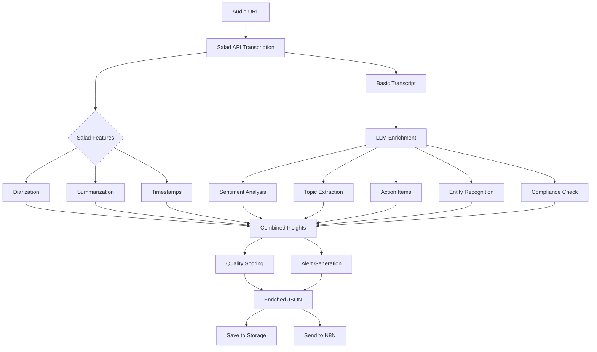

# 📊 Transcript Enrichment Guide - Advanced Metadata & Insights

## Overview

The system now provides comprehensive transcript enrichment using:
1. **Salad API Advanced Features** - Diarization, summarization, word-level timestamps
2. **LLM-Powered Analysis** - Sentiment, topics, action items, compliance
3. **Combined Insights** - Merged analysis from multiple sources

## 🔍 Investigation Results

### 1. Google Service Account Scopes

✅ **Current Scopes are Sufficient**

```python
SCOPES = [
    'https://www.googleapis.com/auth/drive',        # Full Drive access
    'https://www.googleapis.com/auth/drive.file',   # File operations
    'https://www.googleapis.com/auth/drive.metadata' # Metadata access
]
```

These scopes are adequate for:
- Creating and organizing folders
- Uploading transcript JSON files
- Managing metadata
- NO audio files are uploaded (security compliance)

### 2. Salad API Advanced Features

The Salad API supports several advanced features that we now utilize:

#### **Available Features:**
```python
{
    # Speaker Identification
    'diarization': True,              # Identify different speakers
    'sentence_diarization': True,     # Speaker labels per sentence

    # Timestamps
    'word_level_timestamps': True,    # Timing for each word
    'sentence_level_timestamps': True, # Timing for sentences

    # Summarization
    'summarize': 10,                  # Generate 10-sentence summary

    # Formats
    'srt': True,                      # Subtitle format

    # Custom Processing
    'custom_vocabulary': '',          # Domain-specific terms
    'custom_prompt': 'Business call...' # Processing hints
}
```

### 3. LLM Enrichment Capabilities

Since Salad API doesn't provide sentiment analysis or detailed insights, we've implemented LLM enrichment:

#### **Supported LLM Providers:**
- **OpenAI** (GPT-3.5/GPT-4)
- **Anthropic** (Claude)
- **Ollama** (Local models)

## 🎯 Enrichment Features

### 1. Summary Generation
```json
{
  "summary": {
    "executive_summary": "Customer called about billing discrepancy...",
    "main_topic": "Billing adjustment request",
    "outcome": "Issue resolved with $50 credit applied"
  }
}
```

### 2. Sentiment Analysis
```json
{
  "sentiment": {
    "overall_sentiment": "positive",
    "customer_score": 75,
    "agent_score": 90,
    "progression": "improved",
    "emotions": ["satisfied", "relieved"]
  }
}
```

### 3. Topics & Intent
```json
{
  "topics_and_intent": {
    "topics": ["billing", "credit", "service plan"],
    "primary_intent": "resolve_billing_issue",
    "secondary_intents": ["retain_customer"],
    "products_mentioned": ["Premium Plan"],
    "competitors_mentioned": []
  }
}
```

### 4. Action Items
```json
{
  "action_items": {
    "agent_actions": ["Apply $50 credit", "Send confirmation email"],
    "customer_actions": ["Review next bill"],
    "follow_ups": ["Check satisfaction in 7 days"],
    "commitments": ["Credit will appear within 24 hours"],
    "deadlines": ["2025-01-26"]
  }
}
```

### 5. Business Insights
```json
{
  "insights": {
    "pain_points": ["Confusing bill format"],
    "feature_requests": ["Mobile app for billing"],
    "process_improvements": ["Simplify credit application process"],
    "training_needs": [],
    "sales_opportunities": ["Upsell to Premium Plus"],
    "risks": {
      "churn_risk": "low",
      "escalation_risk": "none"
    }
  }
}
```

### 6. Entity Extraction
```json
{
  "entities": {
    "persons": ["John Smith", "Agent Mary"],
    "companies": ["Acme Corp"],
    "products": ["Premium Plan"],
    "locations": ["New York"],
    "reference_numbers": ["INV-12345", "CASE-67890"],
    "dates": ["01/26/2025", "next Monday"],
    "amounts": ["$50.00", "$199.99"],
    "emails": ["john.smith@example.com"],
    "phones": ["+1-917-555-1234"],
    "urls": ["example.com/billing"]
  }
}
```

### 7. Compliance Check
```json
{
  "compliance": {
    "greeting_check": true,
    "closing_check": true,
    "disclosures": ["Privacy policy mentioned"],
    "sensitive_data_handled": true,
    "professionalism_score": 92,
    "policy_adherence": ["Refund policy explained"]
  }
}
```

## 🚀 Implementation

### Configuration

```bash
# Environment Variables

# Salad API (Required)
SALAD_API_KEY=salad_cloud_user_eG0tAkgYi0w0IPPUHpikdfhZG2Auw9MIin9Ld8PdLDQ0HGYCn
SALAD_ORG_NAME=default

# LLM Providers (Optional - choose one or more)
OPENAI_API_KEY=sk-...
ANTHROPIC_API_KEY=sk-ant-...
OLLAMA_URL=http://localhost:11434

# Features
ENABLE_SALAD_FEATURES=true
ENABLE_LLM_ENRICHMENT=true
```

### Usage Example

```python
from src.enrichment.enrichment_pipeline import EnrichmentPipeline
from src.transcription.salad_transcriber_enhanced import SaladTranscriberEnhanced

# Initialize pipeline
pipeline = EnrichmentPipeline(
    enable_salad_features=True,
    enable_llm_enrichment=True,
    openai_api_key=os.getenv('OPENAI_API_KEY')
)

# Configure Salad with advanced features
salad_config = pipeline.configure_salad_job_input()

# Process transcript with enrichment
async def process_call(audio_url, metadata):
    # 1. Transcribe with Salad (includes diarization, summarization)
    transcriber = SaladTranscriberEnhanced(
        enable_diarization=True,
        enable_summarization=True
    )

    result = transcriber.transcribe_file(audio_url)

    # 2. Enrich with LLM insights
    enriched = await pipeline.enrich_transcript(
        transcript_data=result.to_dict(),
        call_metadata=metadata,
        salad_result=result.to_dict()
    )

    return enriched
```

## 📁 Enriched Data Structure

The fully enriched transcript includes:

```json
{
  "original_transcript": {...},
  "call_metadata": {...},
  "enrichment_timestamp": "2025-01-19T15:30:00Z",

  "salad_features": {
    "has_diarization": true,
    "speakers": ["Speaker_1", "Speaker_2"],
    "summary": "10-sentence summary from Salad",
    "word_timestamps": [...],
    "average_confidence": 0.95
  },

  "llm_enrichment": {
    "summary": {...},
    "sentiment": {...},
    "topics_and_intent": {...},
    "action_items": {...},
    "insights": {...},
    "entities": {...},
    "compliance": {...}
  },

  "combined_insights": {
    "summary": {
      "salad": "Salad-generated summary",
      "llm": "LLM-generated summary"
    },
    "sentiment": {...},
    "topics": [...],
    "action_items": [...],
    "entities": {...},
    "speakers": {...}
  },

  "quality_scores": {
    "transcription_quality": 0.95,
    "sentiment_quality": 0.85,
    "compliance_score": 0.92,
    "resolution_score": 1.0,
    "overall_quality": 0.93
  },

  "alerts": [
    {
      "type": "negative_sentiment",
      "severity": "high",
      "message": "Customer expressed frustration",
      "details": {...}
    }
  ]
}
```

## 🔔 Alert System

The system generates alerts for:

1. **Negative Sentiment** - Customer dissatisfaction
2. **High Urgency** - Immediate attention needed
3. **Compliance Issues** - Policy violations
4. **Risk Indicators** - Churn or escalation risks

## 📊 Quality Metrics

### Scoring System
- **Transcription Quality**: Salad confidence scores
- **Sentiment Quality**: Customer and agent satisfaction
- **Compliance Score**: Policy adherence and professionalism
- **Resolution Score**: Issue resolution status
- **Overall Quality**: Weighted combination

## 🔄 Processing Flow



## 💾 Storage Locations

Enriched data is saved to:

```
/data/enriched/
├── complete/          # Full enriched JSON
│   └── recording_123_enriched.json
├── summaries/         # Just summaries
│   └── recording_123_summary.json
├── sentiment/         # Sentiment analysis
│   └── recording_123_sentiment.json
└── insights/          # Business insights
    └── recording_123_insights.json
```

## 🎯 Use Cases

### 1. Customer Service Quality
- Monitor agent performance
- Track customer satisfaction
- Identify training needs

### 2. Business Intelligence
- Extract customer pain points
- Identify upsell opportunities
- Detect churn risks

### 3. Compliance Monitoring
- Verify required disclosures
- Check professionalism
- Flag policy violations

### 4. Operational Efficiency
- Track action items
- Monitor resolution rates
- Analyze call patterns

## 📈 Analytics Queries

### Find Negative Sentiment Calls
```python
# Search for calls with negative sentiment
negative_calls = search_engine.search(
    query="",
    filters={
        'sentiment': 'negative',
        'date_from': '2025-01-01'
    }
)
```

### High-Value Customer Insights
```python
# Get insights for specific customer
customer_insights = enrichment_service.get_customer_insights(
    phone_number='+1234567890',
    period_days=30
)
```

## 🔐 Security Notes

- Audio files are NEVER stored (deleted after transcription)
- Sensitive data in transcripts can be redacted
- API keys are stored securely in environment variables
- All enrichment is performed server-side

## 🚦 Performance Considerations

- **Salad API**: ~10-30 seconds for transcription
- **LLM Enrichment**: ~5-15 seconds additional
- **Total Processing**: ~15-45 seconds per call
- **Concurrent Processing**: Supported via async operations

## 📝 Best Practices

1. **Enable Both Systems**: Use Salad for accuracy, LLM for insights
2. **Monitor API Usage**: Track costs for both services
3. **Cache Results**: Store enriched data to avoid re-processing
4. **Batch Processing**: Process multiple transcripts together
5. **Error Handling**: Gracefully handle API failures

## 🔧 Troubleshooting

### Salad API Issues
```python
# Check Salad API status
transcriber.health_check()

# Retry failed jobs
transcriber.retry_failed_items()
```

### LLM Provider Issues
```python
# Test LLM connectivity
enrichment_service.test_provider('openai')

# Use fallback provider
enrichment_service.set_fallback_provider('ollama')
```

## 📊 Monitoring Dashboard

View enrichment metrics:

```python
# Get enrichment statistics
stats = pipeline.get_enrichment_stats()
print(f"Total enriched: {stats['total_enriched']}")
print(f"Average sentiment: {stats['avg_sentiment']}")
print(f"Alerts generated: {stats['total_alerts']}")
```

---

**Version**: 2.0
**Last Updated**: 2025-01-19
**Status**: Production Ready

## Summary

✅ **Google Scopes**: Current scopes are sufficient
✅ **Salad Features**: Diarization, summarization, timestamps enabled
✅ **LLM Enrichment**: Comprehensive insights via OpenAI/Anthropic/Ollama
✅ **Combined Analysis**: Best of both systems
✅ **Alert System**: Proactive issue detection
✅ **Quality Metrics**: Comprehensive scoring